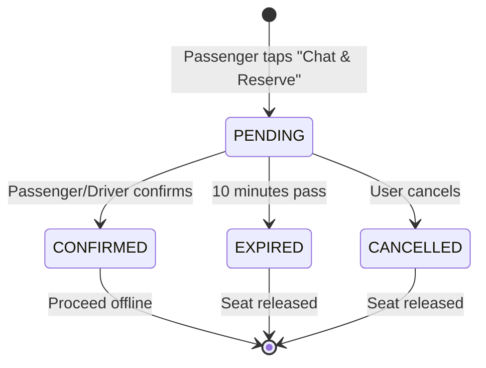
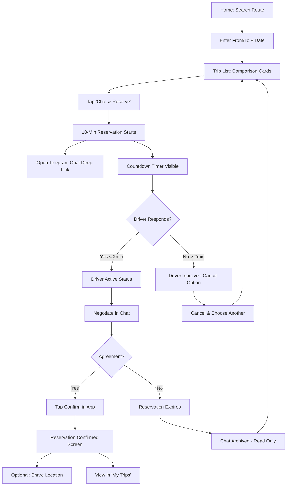

# AstraGo - Complete System Design Document

## Executive Summary

AstraGo is a miniapp-based platform for intercity and interregional shared taxi services. The core innovation is a **time-based soft reservation system** that creates structured urgency without forcing commitment, enabling efficient matching between passengers and drivers while keeping negotiations within the platform.

**Core Principle:** "AstraGo does not force commitment. It creates structured urgency and clarity."

---

## 1. Problem Statement & Market Context

### Current Market Problems

1. **Uncertainty for Passengers:**
   - Don't know when a car will depart
   - Uncomfortable negotiating at stations
   - No transparency on car type, seats, timing, or reliability

2. **Inefficiency for Drivers:**
   - Wait until cars are full
   - Manual coordination overhead
   - No visibility into passenger demand

3. **Platform Bypass Risk:**
   - Users negotiate and then leave the platform
   - No value capture after initial matching

### AstraGo's Solution

- **Transparency:** Real-time seat availability, departure windows, driver reliability
- **Structured Negotiation:** 10-minute soft reservation window with countdown
- **Platform Lock-in:** Time-bound reservations, single active reservation, archived chats
- **No Forced Commitment:** Free, non-binding reservations that auto-expire

---

## 2. Core Mechanism: Time-Based Soft Reservation

### 2.1 Reservation Lifecycle



### 2.2 Key Rules

**Reservation Creation:**
- ✅ **FREE** - No payment required
- ✅ **NON-BINDING** - Can be cancelled anytime
- ✅ **TIME-BOUND** - 10-minute countdown timer
- ✅ **SINGLE ACTIVE** - Only one reservation per passenger at a time
- ✅ **AUTO-EXPIRY** - Automatically releases after 10 minutes

**Seat Management:**
- Seat is **temporarily reserved** (decremented from available)
- If reservation expires or is cancelled, seat is **immediately released**
- Real-time updates via WebSocket to all viewing passengers

**Chat Access:**
- Chat opens via Telegram deep link when reservation is created
- Chat is **active** only during reservation window
- After expiry/cancellation: Chat becomes **read-only** (archived for 24 hours)

### 2.3 Implementation Details

**Backend (`backend/src/services/reservationService.ts`):**
```typescript
const RESERVATION_DURATION_MS = 10 * 60 * 1000; // 10 minutes
const DRIVER_RESPONSE_TIMEOUT_MS = 2 * 60 * 1000; // 2 minutes

// Creates reservation with 10-minute expiry
// Automatically cancels existing active reservation
// Reserves seats in real-time
```

**Frontend (`frontend/hooks/useReservation.ts`):**
- Real-time countdown timer (updates every second)
- Visual progress bar with color transitions
- Auto-refresh reservation status every 5 seconds
- WebSocket subscription for live updates

---

## 3. Driver Response Tracking & Reliability Ranking

### 3.1 Response Time Tracking

**Rules:**
- Track time from reservation creation to driver's first interaction
- If driver doesn't respond within **2 minutes**, mark as "Currently inactive"
- Passenger sees "Cancel & choose another trip" button
- Driver is NOT penalized directly, but ranking is affected

**Implementation:**
```typescript
// backend/src/services/reservationService.ts
export async function checkDriverResponse(reservationId: string): Promise<boolean> {
  // Driver is considered responsive if:
  // 1. Online status = true
  // 2. Last seen within 2 minutes of reservation creation
  return driver.onlineStatus && driver.lastSeen >= reservationTime && 
         driver.lastSeen >= twoMinutesAgo;
}
```

### 3.2 Reliability Ranking Algorithm

**Scoring Formula (`backend/src/services/driverRankingService.ts`):**

```
Total Score (0-100) = 
  Response Time Score (0-40) +
  Response Rate Score (0-30) +
  Online Status Bonus (0-20) +
  Total Trips Bonus (0-10)
```

**Breakdown:**
- **Response Time (0-40 points):**
  - ≤ 1 minute: 40 points
  - ≤ 2 minutes: 30 points
  - ≤ 5 minutes: 20 points
  - > 5 minutes: 10 points
  - No data (new driver): 20 points

- **Response Rate (0-30 points):**
  - Percentage of confirmed reservations
  - Formula: `(confirmedReservations / totalReservations) * 30`

- **Online Status (0-20 points):**
  - Online: 20 points
  - Offline: 0 points

- **Total Trips (0-10 points):**
  - ≥ 50 trips: 10 points
  - ≥ 20 trips: 7 points
  - ≥ 10 trips: 5 points
  - ≥ 5 trips: 3 points
  - < 5 trips: 0 points

**Sorting Priority:**
1. Online drivers first
2. Higher ranking score
3. Sooner departure window
4. More available seats

---

## 4. Trip Listing: Comparison-First Design

### 4.1 Trip Card Requirements

Each trip card **must** display:

✅ **Vehicle Type** - Icon + text (🚗 Sedan, 🚙 SUV, 🚐 Van, 🚌 Bus)  
✅ **Available Seats** - Real-time badge (e.g., "2 / 4")  
✅ **Route** - From → To with clear arrow  
✅ **Departure Window** - Time range (e.g., "14:00 - 14:30")  
✅ **Pickup Options:**
   - Station only
   - Home pickup available (badge)
✅ **Delivery Options:**
   - Passenger only
   - Cargo/post accepted (badge)
✅ **Driver Status** - Online/Offline indicator  
✅ **Driver Reliability** - Ranking score (⭐ 85.5)  
✅ **CTA Button** - "Chat & Reserve (10 min)"

**Implementation:** `frontend/components/trips/TripCard.tsx`

### 4.2 Default Sorting

**Priority Order:**
1. **Online drivers first** - Always show online drivers before offline
2. **Sooner departure window** - Earlier trips appear first
3. **More available seats** - More seats = higher priority
4. **Higher driver ranking** - Better reliability scores

**Implementation:** `backend/src/controllers/tripController.ts` - `getTrips()` function

### 4.3 Filters

Available filters:
- ✅ **Online Only** - Show only online drivers
- ✅ **Home Pickup** - Show only trips with home pickup
- ✅ **Cargo Accepted** - Show only trips accepting cargo
- ✅ **Earliest Departure** - Prioritize trips leaving soonest

**Sort Options:**
- By departure time (asc/desc)
- By available seats (asc/desc)
- By driver ranking (asc/desc)

**Implementation:** `frontend/components/trips/TripList.tsx`

---

## 5. Passenger Flow (UX)

### 5.1 Complete User Journey



### 5.2 Key UX Principles

**Never Trap Users:**
- ✅ Passenger can cancel anytime
- ✅ Can immediately select another trip after cancellation
- ✅ No forced waiting beyond 10 minutes
- ✅ Clear "Cancel & choose another" button if driver inactive

**Create Urgency (Not Pressure):**
- ✅ Visible countdown timer (MM:SS format)
- ✅ Color transitions (green → yellow → red)
- ✅ Progress bar showing time remaining
- ✅ Real-time seat updates (others might take the seat)

**Maintain Context:**
- ✅ Archived chats visible for 24 hours
- ✅ Reservation history in "My Trips"
- ✅ Driver reliability visible before reserving

---

## 6. Why Users Stay Inside AstraGo

### 6.1 Platform Value Propositions

**What Telegram/Phone Calls Cannot Provide:**

1. **Time-Bound Seat Reservation**
   - Telegram: No seat locking mechanism
   - AstraGo: 10-minute guaranteed seat hold

2. **Live Seat Availability**
   - Phone: Static information, no real-time updates
   - AstraGo: WebSocket-powered live updates

3. **Trip Comparison**
   - Phone: One call at a time, no comparison
   - AstraGo: Side-by-side comparison of all trips

4. **Driver Reliability Signals**
   - Phone: No historical data
   - AstraGo: Ranking score, response rate, response time

### 6.2 Lock-in Mechanisms

**Reservation Pressure:**
- Countdown timer creates urgency
- Seat is temporarily reserved (visible to others)
- Cannot create multiple reservations simultaneously

**Real-Time Logic:**
- Seat availability updates instantly
- Other passengers see decreasing seats
- Creates FOMO (fear of missing out)

**Archived Chats:**
- Context is preserved for 24 hours
- Users can reference previous negotiations
- Encourages returning to platform

**Driver Reliability Ranking:**
- Only visible within platform
- Helps users make informed decisions
- Builds trust in platform's value

---

## 7. System Architecture

### 7.1 High-Level Architecture

```
┌─────────────────────────────────────────────────────────────┐
│                     Frontend (Next.js)                       │
│  ┌──────────┐  ┌──────────┐  ┌──────────┐  ┌──────────┐   │
│  │   Home   │  │ Trip List│  │Trip Detail│  │ My Trips │   │
│  └──────────┘  └──────────┘  └──────────┘  └──────────┘   │
│         │            │             │              │         │
│         └────────────┴─────────────┴──────────────┘         │
│                        │                                      │
│              React Query / SWR (Data Fetching)                │
│              WebSocket Client (Real-time Updates)            │
└────────────────────────┼──────────────────────────────────────┘
                         │
         ┌───────────────┴───────────────┐
         │                               │
┌────────▼────────┐            ┌────────▼────────┐
│  REST API       │            │  WebSocket      │
│  (Express)      │            │  Server         │
└────────┬────────┘            └────────┬────────┘
         │                               │
         └───────────────┬───────────────┘
                         │
         ┌───────────────▼───────────────┐
         │      PostgreSQL Database       │
         │  ┌──────────────────────────┐  │
         │  │ Users, Trips, Reservations│  │
         │  │ Seat Availability, Chats  │  │
         │  │ Driver Metrics           │  │
         │  └──────────────────────────┘  │
         └────────────────────────────────┘
```

### 7.2 Database Schema

**Core Tables:**
- `users` - Passengers and drivers (Telegram auth)
- `trips` - Trip listings with all details
- `reservations` - Soft reservations with expiry
- `seat_availability` - Real-time seat tracking
- `chats` - Chat session metadata
- `driver_metrics` - Reliability tracking

**Key Indexes:**
- `reservations(passengerId, status)` - Fast active reservation lookup
- `reservations(expiresAt)` - Efficient expiry queries
- `trips(routeFrom, routeTo)` - Route search optimization
- `driver_metrics(rankingScore)` - Sorting optimization

### 7.3 Real-Time Updates (WebSocket)

**Events:**
- `seat_availability_changed` - Broadcast when seats update
- `reservation_created` - Notify driver of new reservation
- `reservation_expired` - Notify both parties
- `reservation_confirmed` - Confirmation notification
- `driver_status_changed` - Online/offline updates
- `trip_updated` - Trip details changed

**Implementation:** `backend/src/websocket/handlers.ts`

---

## 8. Driver Behavior & Fairness

### 8.1 Driver Flexibility

**Seat Management:**
- ✅ Drivers can edit available seat count at any time
- ✅ Accounts for offline passengers they found outside app
- ✅ Real-time updates to all viewing passengers
- ✅ No penalty for adjusting seats

**Response Time:**
- ✅ Drivers are NOT penalized directly
- ✅ However, slow responses affect ranking
- ✅ Online & responsive drivers are prioritized automatically

### 8.2 Fairness Mechanisms

**No Direct Penalties:**
- Drivers can be offline
- Can find passengers outside app
- Can adjust seat availability freely

**Indirect Incentives:**
- Better ranking = higher visibility
- Faster response = better ranking
- Online status = ranking bonus
- More confirmed reservations = better ranking

**Implementation:** `backend/src/services/driverRankingService.ts`

---

## 9. Chat Integration (MVP)

### 9.1 Telegram Deep Link (Current)

**Implementation:**
- Generate deep link: `https://t.me/{username}` or `tg://resolve?phone={phone}`
- Open in Telegram app when reservation is created
- Track chat opens via analytics

**Code:** `backend/src/services/telegramService.ts`

### 9.2 Future In-App Chat

**Architecture Ready:**
- `chats` table already exists
- WebSocket infrastructure in place
- Can add `chat_messages` table when ready
- Read receipts and typing indicators possible

**Migration Path:**
1. Add `chat_messages` table
2. Implement WebSocket message handlers
3. Build chat UI component
4. Maintain Telegram deep link as fallback

---

## 10. Future-Ready Architecture

### 10.1 Payment Integration Points

**Current State:**
- No payment processing
- Reservations are free

**Future Ready:**
- `reservations` table can add `payment_status` field
- Can create `payments` table
- Stripe/PayPal integration points identified

### 10.2 Insurance & Company Accounts

**Current State:**
- Individual drivers only

**Future Ready:**
- Can add `insurance_provider` to trips
- Can create `companies` table for fleet management
- Can add `company_id` to users (drivers)

### 10.3 Ratings & Reviews

**Current State:**
- Driver metrics only (reliability ranking)

**Future Ready:**
- Can create `reviews` table
- Can add `rating` to `driver_metrics`
- Can display ratings in trip cards

---

## 11. Implementation Verification

### 11.1 Core Requirements Checklist

✅ **Time-Based Soft Reservation**
- 10-minute countdown implemented
- Auto-expiry on timeout
- Single active reservation constraint
- Free and non-binding

✅ **Chat Rules**
- Telegram deep link integration
- Chat archived after expiry
- Read-only status after expiry

✅ **Driver Response Tracking**
- 2-minute timeout check
- Inactive driver marking
- Cancel option for passengers

✅ **Trip Listing**
- Comparison-first card design
- All required fields displayed
- Sorting and filtering implemented

✅ **Driver Ranking**
- Reliability scoring algorithm
- Response time tracking
- Response rate calculation
- Online status bonus

✅ **Real-Time Updates**
- WebSocket server implemented
- Seat availability live updates
- Reservation status broadcasts

### 11.2 UX Requirements Checklist

✅ **Passenger Flow**
- Search → List → Reserve → Negotiate → Confirm/Cancel
- Never trapped or forced to wait
- Can cancel and choose another trip

✅ **Visual Design**
- Minimalist, modern, flat UI
- Clear icons and color cues
- Smooth animations (Framer Motion)
- Timer with color transitions

✅ **Platform Integration**
- Telegram Mini App ready
- PWA-ready architecture
- Authentication via Telegram

---

## 12. Technical Stack

### 12.1 Frontend
- **Framework:** Next.js 14 (App Router)
- **Language:** TypeScript
- **Styling:** Tailwind CSS
- **Animations:** Framer Motion
- **State Management:** React Query + Zustand
- **Real-Time:** Socket.io Client
- **Telegram:** @twa-dev/sdk

### 12.2 Backend
- **Runtime:** Node.js
- **Framework:** Express.js
- **Language:** TypeScript
- **Database:** PostgreSQL (Prisma ORM)
- **Real-Time:** Socket.io
- **Validation:** Zod
- **Authentication:** Telegram initData validation

### 12.3 Deployment
- **Frontend:** Vercel (recommended)
- **Backend:** Railway / Render
- **Database:** Railway PostgreSQL / Supabase
- **WebSocket:** Same backend server

---

## 13. Security Considerations

### 13.1 Authentication
- Telegram `initData` validation
- Hash verification on backend
- User identity verified by Telegram

### 13.2 Data Protection
- Rate limiting on reservation creation
- Database constraints prevent seat overselling
- WebSocket connection authentication
- Input validation and sanitization

### 13.3 CORS Configuration
- Configured for Telegram Mini App
- Environment-specific origins

---

## 14. Success Metrics

### 14.1 Key Performance Indicators

**Matching Efficiency:**
- Reservation-to-confirmation rate
- Average time to confirmation
- Driver response time

**Platform Engagement:**
- Active reservations per day
- Average session duration
- Return user rate

**Driver Quality:**
- Average driver ranking score
- Response rate percentage
- Online driver percentage

**User Satisfaction:**
- Cancellation rate (should be low)
- Time to find trip
- Comparison usage (filters/sorting)

---

## 15. Conclusion

AstraGo successfully implements a **time-based soft reservation system** that creates structured urgency without forcing commitment. The platform provides:

1. **Transparency** - Real-time seat availability, departure windows, driver reliability
2. **Efficiency** - Structured negotiation window, automated matching
3. **User Control** - Free, non-binding reservations, easy cancellation
4. **Platform Value** - Time-bound reservations, live updates, reliability signals

The architecture is **future-ready** for payments, insurance, company accounts, and ratings while maintaining the core principle: **"AstraGo does not force commitment. It creates structured urgency and clarity."**

---

**Document Version:** 1.0  
**Last Updated:** 2024  
**Status:** Implementation Complete
